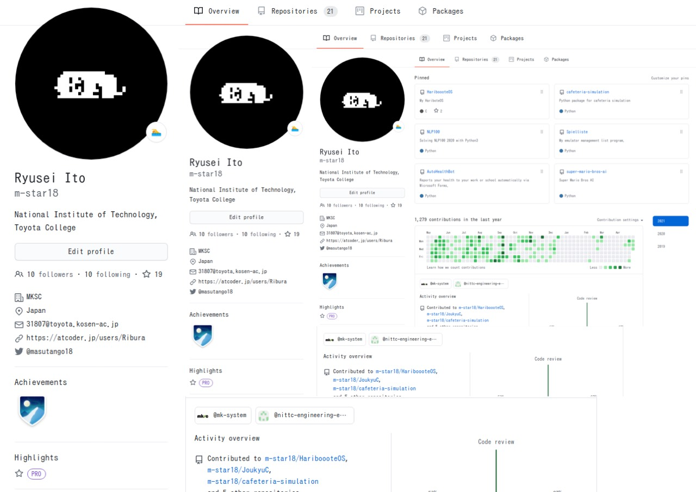

## 👋 Hi there 
My name is Ryusei Ito, and I'm currently in my 5th year studying Information Engineering at the National Institute of Technology, Toyota College. 

Lately, I've found myself captivated by the world of mathematics. Over the years, I've gained experience as a machine learning engineer and full-stack developer.Presently, I'm primarily focusing on my startup while also engaging in collaborative research with corporations and working at AI startups. 

My research revolves around aspect-based sentiment analysis within the realm of natural language processing. I'm passionate about learning and exploring new areas of research.

- 🔭 I'm currently studying Rust and working on research in NLP and autonomous driving.
- 🍔 I'm a huge fan of hamburgers and ramen!
- 🏊‍♂️ I spent 15 years as a swimmer, and these days I'm embracing the challenge of running.
- 💬 My interests lie in the theories behind reinforcement learning and optimization on Riemannian manifolds.

